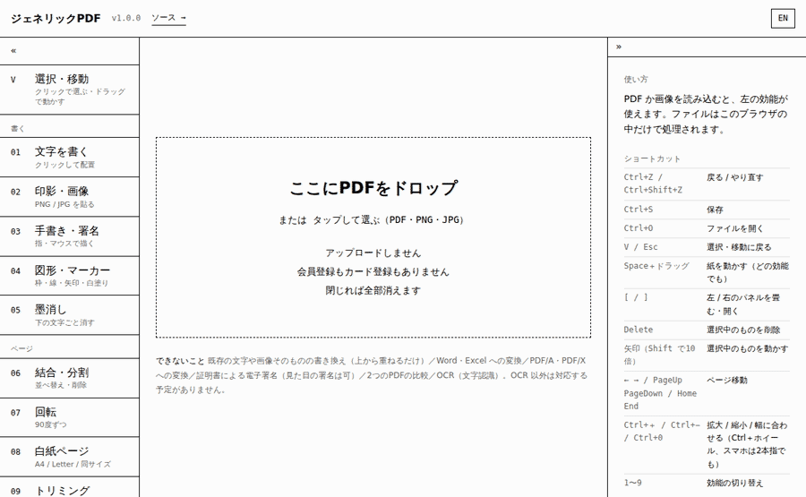
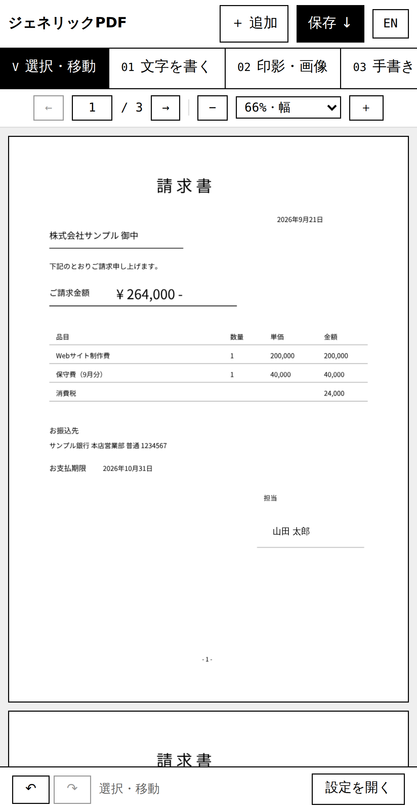

<div align="center">

# ジェネリックPDF

### PDFの編集に、アップロードは要りません。

名前を書いて、印鑑を押して、保存する。ぜんぶブラウザの中で終わります。<br>
**HTML 1ファイル。16の機能。0円。登録なし。広告なし。**

[**いますぐ使う →**](https://ilove-ai.net/pdf) &nbsp;·&nbsp; [1ファイルをダウンロード](../../releases) &nbsp;·&nbsp; [English](#english)



<sub>請求書に名前を書いて、印鑑を押して、保存する。17秒。ぜんぶブラウザの中。</sub>

</div>

---

## PDFに一行足すために、私たちは何を払っているか

請求書に名前を入れて、印鑑を押して、送り返す。それだけのことに、いまは選択肢が2つしかありません。

- 月額を払って専用ソフトを入れる
- 無料のWebサービスに、その書類を渡す

1つ目は、私が払っていたほうです。**Acrobat に年23,760円**（年間契約で月1,980円。月々契約なら月3,300円）。
2つ目は、どうしても気が進みませんでした。

だから `index.html` を1枚書きました。**ジェネリックPDF はこの1ファイルで全部です。**
ダウンロードしてダブルクリックすれば動きます。ビルドも、インストールも、アカウントもありません。

## 「送っていません」は、あなたが確かめられます

アップロードしないと書いてあるサイトは多く、確かめられるものは多くありません。
このツールは1ファイルなので、数えれば終わります。

| 調べるもの | 結果 |
|---|---|
| `fetch(` | **1か所** — 日本語フォントの取得（1692行目） |
| `XMLHttpRequest` | **0か所** — コメントに名前が出るだけ |
| `FormData` / `sendBeacon` / `WebSocket` | **0か所** |
| `POST` | **0か所** |

```sh
grep -n 'fetch(\|XMLHttpRequest\|FormData\|sendBeacon\|POST' index.html
```

読み込んだPDFは `FileReader` でメモリに乗るだけ、保存は `Blob` を `a[download]` に渡すだけです。
ネットワークに出るのは、ライブラリ・日本語フォント・画面用のWebフォントを**取ってくる**通信だけ。

いちばん早い確認方法は、開発者ツールのネットワークタブを開いたままPDFを編集することです。**POST は1件も出ません。**

こちらでも毎回測っています。headless Chromium で16の効能をひと通り操作したときの記録です。

| 実測した項目 | 結果 |
|---|---|
| GET 以外のリクエスト | **0件** |
| 本文のあるリクエスト | **0件** |
| 通信先 | 同一オリジン / cdnjs / jsDelivr / Google Fonts のみ |

`localStorage` に残るのは言語（`gp-lang`）とパネルの開閉（`gp-ui`）の2つだけ。タブを閉じれば、書類は跡形もなく消えます。

## できること

| # | 効能 | 内容 |
|---|---|---|
| 01 | 文字を書く | タップした場所にその場で入力。書き直し・移動・サイズ・色。日本語OK |
| 02 | 印影・画像 | PNG（透過OK）/ JPG を置く。拡大縮小・移動 |
| 03 | 手書き・署名 | 指やマウスで描く。色・太さ |
| 04 | 図形・マーカー | 枠線・黄色マーカー・白塗り（修正液）・直線・矢印 |
| 05 | 墨消し | 黒い箱を置くと、**そのページは画像化され、下にあった文字は完全に消えます** |
| 06 | 結合・分割 | 複数PDFを読み込んで並べ替え・削除、範囲を指定して分割保存 |
| 07 | 回転 | ページ単位・全ページ、90度ずつ |
| 08 | 白紙ページ | A4・Letter・表示中のページと同サイズを差し込む |
| 09 | トリミング | ドラッグで範囲を決めて、1ページ or 全ページに適用 |
| 10 | 透かし | 文字または画像を全ページに。濃さ・角度 |
| 11 | ページ番号 | `{n} / {N}` などの書式、6か所、開始番号、0埋め（ベイツ番号） |
| 12 | フォーム記入 | 入力欄に記入して確定（平坦化）。テキスト・チェック・ラジオ・ドロップダウン・リスト |
| 13 | 情報 | タイトル・作成者・キーワード。読み込んだファイルの版とサイズ |
| 14 | 画像に変換 | PDF → PNG / JPG（72・150・300dpi、複数ページはzip）。PNG / JPG を放り込めば逆方向も |
| 15 | 圧縮 | 劣化なし（構造の最適化）と、画像化（劣化あり・文字が検索できなくなる旨を画面に明記） |
| 16 | パスワード | AES-256で保護（開く／権限、印刷・編集の禁止）。保護付きPDFはパスワードを聞いて外す |

**見る・動かす**: 全ページを縦に連続スクロール。ページ番号を打って移動。最初は「選択・移動」なので、紙をクリックしても何も置かれません。空いている所をドラッグすれば紙が動きます。

**拡大・縮小**: ＋ / −、倍率の選択（幅に合わせる・全体・25〜400%）、Ctrl＋ホイール（カーソルの下が動きません）、スマホは2本指。

**ショートカット**: Ctrl+Z / Ctrl+Shift+Z、Ctrl+S、Ctrl+O、Delete、矢印キー、V / Esc、1〜9。

## できないこと

できることより、ここを先に読んでもらったほうが早いと思います。**OCR以外は、対応する予定もありません。**

| できないこと | 理由・代わりにできること |
|---|---|
| 既存の文字や画像そのものの書き換え | 上から重ねるだけです。白塗り＋文字入れで実質的には置き換えられます |
| Word・Excel・PowerPoint への変換 | ブラウザの中では品質が出ません |
| PDF/A・PDF/X への変換 | 検証器なしに「準拠」とは書けません |
| 証明書による電子署名 | 見た目の署名（手書き・画像）はできます。暗号署名は対象外です |
| 2つのPDFの比較 | — |
| OCR（文字認識） | 検討中。日本語の精度とダウンロード量が見合うか、先に試します |
| XFA形式のフォーム | AcroForm のみ対応です |
| オフラインで動かす | ライブラリとフォントはネットから取ります |

## スマホでも、ちゃんと使えます

<div align="center">

</div>

上に効能、中央に紙、下に1行のバー。文字はその場で入力でき、置いた文字は指で掴んで動かせます。
選んだものの上に「書き直す・設定・削除」が出て、戻る／やり直すは下のバーにあります。指を離しても紙は慣性で滑ります。

## 中身

`index.html` の1ファイル、2,053行、148KB。ビルド工程はありません。ブラウザで開いて、そのまま直せます。

| 使っているもの | ライセンス | 用途 |
|---|---|---|
| [pdf-lib](https://github.com/Hopding/pdf-lib) 1.17.1 | MIT | PDFの書き出し |
| [@pdf-lib/fontkit](https://github.com/Hopding/fontkit) 1.1.1 | MIT | フォント埋め込み |
| [pdf.js](https://github.com/mozilla/pdf.js) 4.10.38 | Apache-2.0 | 表示・画像化 |
| [qpdf-wasm](https://github.com/jsscheller/qpdf-wasm) 0.0.2 | Apache-2.0 | パスワード・劣化なし圧縮（必要なときだけ読み込み） |
| [Noto Sans JP](https://github.com/notofonts/noto-cjk) | SIL OFL 1.1 | 日本語の文字入れ |

すべてバージョンを固定してCDNから読み込みます。本体は **MIT License**（[LICENSE](LICENSE)）。

バグ報告・要望は [Issues](../../issues) へ。各社の商標は各社に帰属し、本ツールは各社と無関係です。

---

<a name="english"></a>

## English

### Editing a PDF should not require uploading it.

Sign it, stamp it, save it — all inside your browser. **One HTML file. 16 tools. Free. No account, no ads.**

I was paying ¥23,760 a year for Acrobat. The alternative was handing my documents to a free web service. Neither appealed, so I wrote one HTML file instead.

[**Use it now →**](https://ilove-ai.net/pdf) &nbsp;·&nbsp; [Download the single file](../../releases)

**Don't take "we don't upload" on faith — count it yourself.** The whole app is one file:

| What to look for | Result |
|---|---|
| `fetch(` | **1 occurrence** — fetching the Japanese font (line 1692) |
| `XMLHttpRequest` | **0** — the name only appears in a comment |
| `FormData` / `sendBeacon` / `WebSocket` | **0** |
| `POST` | **0** |

Your PDF is read into memory with `FileReader`; saving hands a `Blob` to `a[download]`. The only network traffic **fetches** libraries, the Japanese font, and the UI web font. Open your browser's Network tab and edit a PDF: not a single POST. `localStorage` holds two things — the language (`gp-lang`) and whether the side panels are folded (`gp-ui`). Close the tab and the document is gone.

**What it does.** Text (typed in place, movable, Japanese OK) · stamps and images · freehand signatures · boxes, highlighter, white-out, lines, arrows · redaction (the page is rasterized, so what was underneath is really gone) · merge, split, reorder · rotate · blank pages · crop · watermarks · page numbers and Bates numbering · AcroForm filling with flatten · metadata · PDF ⇄ PNG/JPG (zip for multi-page) · lossless and lossy compression · AES-256 passwords, and removing them.

Continuous scrolling through all pages, zoom from 25% to 400% (Ctrl+wheel stays anchored under the cursor), select/pan as the default mode, and a phone layout with in-place typing, drag-to-move, momentum panning and pinch zoom. Japanese and English UI.

**What it does not do**, and — apart from OCR — is not planned to: editing existing text or images in place (you overlay instead; white-out plus text does the job) · converting to Word/Excel/PowerPoint · PDF/A or PDF/X · certificate-based digital signatures (a drawn or image signature is fine) · comparing two PDFs · OCR (under consideration) · XFA forms · working offline (libraries and fonts come from a CDN).

**Built with** pdf-lib (MIT), @pdf-lib/fontkit (MIT), pdf.js (Apache-2.0), qpdf-wasm (Apache-2.0, loaded on demand) and Noto Sans JP (SIL OFL 1.1), all pinned. The app itself is MIT. 2,053 lines, 148 KB, no build step — open it in a browser and edit it. Bug reports and requests: [Issues](../../issues).
